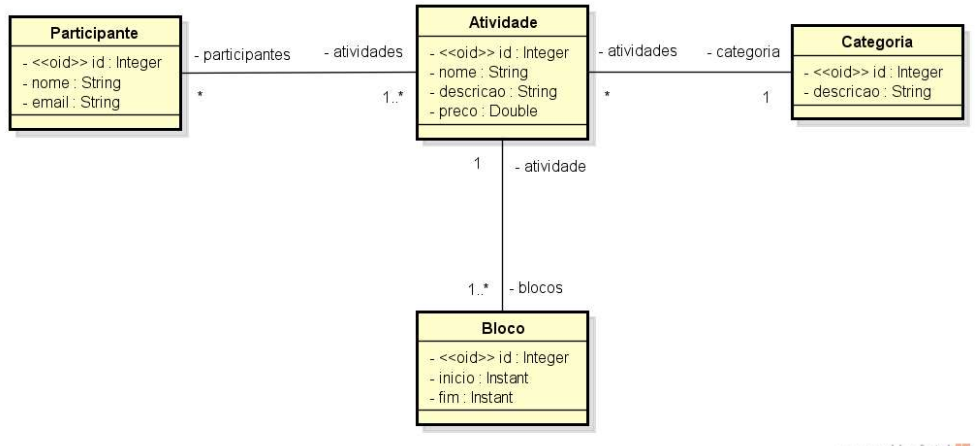
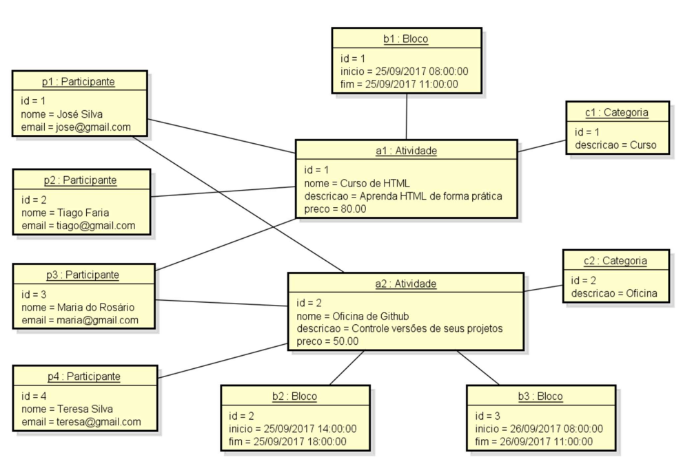
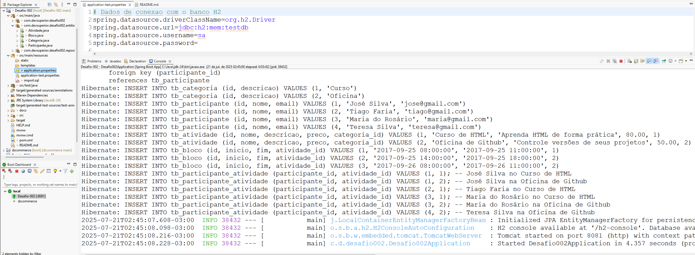

# Desafio 002 - Sistema Evento

Projeto Java/Spring Boot.

## Regras de Negócio

Gerenciar participantes em uma atividade de um evento acadêmico. 
As atividades do evento podem ser, por exemplo, palestras, cursos, oficinas práticas, etc. 
Cada atividade que ocorre possui nome, descrição, preço. 
As atividades podem ser divididas em vários blocos de horários.
  
Por exemplo: 
Um curso de HTML pode ocorrer em dois blocos, sendo necessário armazenar o dia e os horários de início de fim do bloco daquele dia). 
Para cada participante, deseja-se cadastrar seu nome e email. 

## Modelo de domínio ERD

--
## Instância dos dados para seeding

## Como Executar

1. Clone o repositório.
2. Execute a aplicação.
3. O resultado será exibido no console.

### Exemplo de Execução

### Entrada
- Ao rodar a aplicação, o seeding da base de dados e efetuado através das queries de INSERT no arquivo import.sql

### Saída
- Configurado para rodar na porta 8081
  Acessar: Menu - run - run configurations - arguments: --server.port=8081
    
- Conferir pelo http://localhost:8081/h2-console
   url=jdbc:h2:mem:testdb
   username=sa
   password=
      vide: aplication.test.properties  
---

## Prints de Evidências

### Execução no Console da IDE 

### Entrada

-- queries arquivo import.sql 

### Saída

- Rodar a aplicação e conferir pelo http://localhost:8081/h2-console

---

## Estrutura do Projeto

- `Categoria` - Classe de Categoria
- `Atividade` - Classe de Atividade
- `Participante` - Classe de Participante
- `Bloco` - Classe de Bloco
---

## Observações

- Os prints estão salvos na pasta `docs` do projeto.
- O projeto tem entrada de dados pelo arquivo import.sql.

# 
## Autor
   Francisco Casemiro Lira
    
   https://www.linkedin.com/in/franciscoclira
   